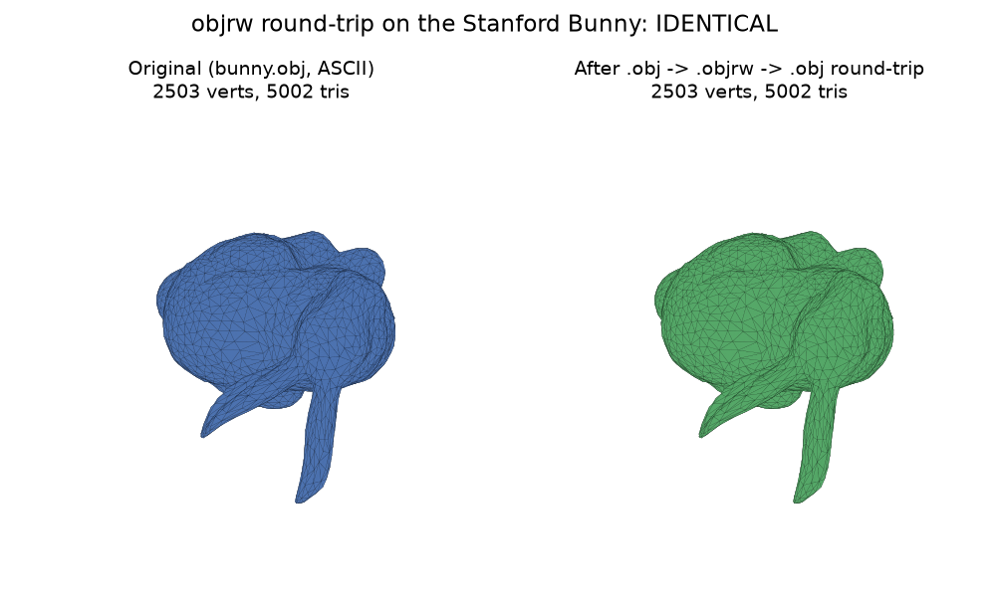

# MeshObjRW (`objrw`)

[](LICENSE)

> ⚠️ **Work in progress.** Research-grade code, build- and correctness-verified
> on CPU (OpenMP) and real CUDA GPU hardware (C tests + Python tests, both
> backends), but not yet independently reviewed or hardened for production.
> See [Disclaimer & TODO](#disclaimer--work-in-progress).

A fast, portable, multi-platform C/C++ library for **reading and writing
triangular mesh files**, with a documented binary companion format, an
optional GPU (CUDA) acceleration path, and a high-level **Python** wrapper
built on `ctypes`.



*Figure generated by round-tripping the Stanford Bunny (a classic research
test mesh) through the real `objrw_io` read/write API — see
`docs/generate_figure.py`.*

`objrw` reads and writes two encodings:

| Encoding | Extension | Notes |
|----------|-----------|-------|
| ASCII Wavefront **OBJ** | `.obj` | The canonical text format. `v`, `vt`, `vn`, `f`; 1-based & negative indices; per-corner `v/vt//vn` syntax; n-gons fan-triangulated. |
| Binary **objrw** (objrw) | `.objrw` | Compact, documented, little-endian, versioned. Auto-detected on read via an 8-byte magic header. |

A single read call, `objrw_read()` / `objrw_io.readOBJ()`, **auto-detects**
the encoding by sniffing the file header, so the same code transparently
handles both ASCII and binary files.

All public symbols carry the `objrw` prefix (library `objrw`, CLI
`objrw_cli`, tests `objrw_tests`, Python package `objrw_io`) so the
package does not clash with other dependencies in larger projects.

---

## Features

- **Portable C ABI** — a plain C11 shared library (C linkage) usable from C,
  C++, Python (`ctypes`), and other FFI languages.
- **Multi-platform** — builds and tests on **Windows (MSVC/Clang)**,
  **macOS**, and **Linux (GCC/Clang)**.
- **Fast & parallel** — the ASCII OBJ **reader** uses a two-phase, line-aligned
  chunked parse parallelised with **OpenMP** when available (fully functional
  and dependency-free when OpenMP is absent). The writer is single-threaded.
- **GPU option** — an optional **CUDA** port for the geometry helpers
  (bounding box, per-vertex normals, and area/volume statistics), gated
  behind `OBJRW_ENABLE_CUDA` (OFF by default, transparent CPU fallback).
- **Geometry helpers** — bounding box, surface area, signed volume, and
  area-weighted per-vertex normal recomputation.
- **Python** — `objrw_io`, a thin, dependency-free `ctypes` wrapper whose
  primary API is `objrw_io.readOBJ(path)` / `objrw_io.writeOBJ(mesh, path,
  flagBinary=...)`, plus a `Mesh` object and lower-level helpers. No numpy
  required.
- **Accurate & tested** — a C test suite (53 checks) plus Python end-to-end
  tests, all runnable on CI across the three platforms.

---

## Getting started (Python, 3 steps)

The whole job is `import objrw_io`, then `readOBJ` / `writeOBJ`. No `pip
install`, no numpy — the only prerequisite is building the C library once.

```python
import objrw_io

mesh_in  = objrw_io.readOBJ("path/to/meshFile.obj")     # read (auto-detects .obj / .objrw)
mesh_out = objrw_io.writeOBJ(mesh_in, "path/to/out.obj")          # write ASCII .obj
# mesh_out = objrw_io.writeOBJ(mesh_in, "out.objrw", flagBinary=True)  # or compact binary
```

That's it. `readOBJ` transparently accepts an ASCII `.obj` **or** a binary
`.objrw` file; `writeOBJ` returns the same `Mesh`, so it can be assigned or
chained. Errors are `TypeError` for bad arguments and `objrw_io.OBJRWError`
(with a numeric `.code`) for I/O or parse problems.

To run this today, build once, then run the self-contained kick-off script:

```powershell
# 1. build the C library (Windows example; see below for macOS / Linux)
cmake -S . -B build -G "Visual Studio 17 2022" -A x64 -DCMAKE_BUILD_TYPE=Release
cmake --build build --config Release

# 2. run the kick-off (works with no input file — it builds a cube for you)
python examples/objrw_kickoff.py            # self-contained demo
python examples/objrw_kickoff.py myMesh.obj # or start from your own .obj
```

A full reference lives in [`docs/python-usage.md`](docs/python-usage.md).

---

## Repository layout

```
.
├── include/
│   └── objrw.h              # Public C-ABI header
├── src/
│   ├── objrw_internal.h     # Internal declarations
│   ├── objrw.cpp            # Lifecycle, dispatch, geometry helpers
│   ├── objrw_ascii.cpp      # ASCII OBJ parser / writer
│   ├── objrw_binary.cpp     # objrw binary reader / writer
│   └── objrw_cuda.cu        # Optional CUDA kernels (OBJRW_ENABLE_CUDA)
├── tools/
│   └── objrw_cli.cpp        # Command-line front-end
├── tests/
│   └── objrw_tests.cpp      # C test suite (53 checks)
├── python/
│   ├── objrw_io/            # Python package (ctypes wrapper)
│   │   ├── __init__.py
│   │   ├── _version.py
│   │   ├── _errors.py
│   │   ├── _library.py       # cross-platform library discovery
│   │   ├── _ctypes.py        # prototype declarations + wrappers
│   │   └── _mesh.py          # high-level Mesh object
│   └── test_objrw_io.py     # Python end-to-end tests
├── examples/
│   └── objrw_kickoff.py     # Minimal, runnable read/write kick-off script
├── docs/                     # detailed documentation
├── CMakeLists.txt
├── LICENSE                   # CC BY-NC 4.0 (research only, no commercial use)
└── .github/workflows/ci.yml  # CI matrix (win / macos / linux)
```

---

## Building

### Prerequisites

- CMake ≥ 3.16
- A C++17 compiler:
  - **Windows:** MSVC (Visual Studio 2019/2022) or Clang
  - **macOS:** `clang` (Xcode command line tools)
  - **Linux:** `g++` or `clang++`
- *(optional)* CUDA toolkit, if you want the GPU path

### Build (any platform)

```sh
cmake -S . -B build -DCMAKE_BUILD_TYPE=Release
cmake --build build --config Release --parallel
```

Windows (MSVC, multi-config) example:

```powershell
cmake -S . -B build -G "Visual Studio 17 2022" -A x64 -DCMAKE_BUILD_TYPE=Release
cmake --build build --config Release
```

This produces:

- `objrw` shared library — `objrw.dll` / `libobjrw.so` / `libobjrw.dylib`
- `objrw_cli` — command-line tool
- `objrw_tests` — the C test suite

### Options

| CMake option | Default | Description |
|--------------|---------|-------------|
| `OBJRW_BUILD_TESTS` | `ON` | Build the C test suite. |
| `OBJRW_BUILD_CLI` | `ON` | Build `objrw_cli`. |
| `OBJRW_ENABLE_OPENMP` | `ON` | Parallelise the ASCII OBJ reader with OpenMP (no-op if absent). |
| `OBJRW_ENABLE_CUDA` | `OFF` | Compile the optional CUDA kernels (`src/objrw_cuda.cu`). Requires a CUDA toolkit (`nvcc`) — enabled via CMake's `enable_language(CUDA)`. |

---

## Testing

### C tests

```sh
# run the test executable (location depends on build type)
./build/Release/objrw_tests          # Windows MSVC
# or, single-config builds:
./build/objrw_tests
```

Expected output ends with:

```
PASS: 53   FAIL: 0
ALL TESTS PASSED
```

### Python tests

Make sure the built library is discoverable (see below), then:

```sh
python python/test_objrw_io.py
```

Expected output ends with:

```
ALL PYTHON TESTS PASSED
```

---

## Command-line usage (`objrw_cli`)

```sh
objrw_cli info     model.obj          # summary: counts, bbox, area, name
objrw_cli ascii    in.objrw  out.obj  # binary -> ASCII
objrw_cli binary   in.obj    out.objrw# ASCII  -> binary
objrw_cli normals  in.obj  out.obj    # recompute per-vertex normals
objrw_cli version                                 # print build info
```

Examples:

```sh
objrw_cli info cube.obj
objrw_cli binary cube.obj cube.objrw
objrw_cli info cube.objrw
```

---

## Python usage (`objrw_io`)

`objrw_io` is a thin `ctypes` wrapper. It locates the shared library
automatically (source checkout layout, `OBJRW_LIBRARY_PATH`, or the system
path). A single `import objrw_io` is all that is needed:

```python
import objrw_io

# Import — encoding is auto-detected (ASCII .obj or binary .objrw).
mesh_in = objrw_io.readOBJ("path/to/meshFile.obj")
print(mesh_in.num_vertices, mesh_in.num_triangles)
print(mesh_in.bounding_box())      # (min, max)
print(mesh_in.stats())             # (area, signed_volume)

mesh_in.compute_normals()          # area-weighted per-vertex normals

# Export — ASCII OBJ by default, compact binary when flagBinary=True.
mesh_out = objrw_io.writeOBJ(mesh_in, "path/to/output/meshFile.obj",
                             flagBinary=False)          # ASCII .obj
# mesh_out = objrw_io.writeOBJ(mesh_in, "out.objrw", flagBinary=True)
```

`readOBJ` / `writeOBJ` validate their arguments and raise `TypeError` on
bad inputs or `objrw_io.OBJRWError` (with a numeric `.code`) on I/O or parse
failure. The lower-level `objrw_io.read` / `write_ascii` / `write_binary`
helpers and the `Mesh` object remain available for explicit control.

Building a mesh from scratch:

```python
m = objrw_io.Mesh()
m.object_name = "my_mesh"

i0 = m.add_vertex(0.0, 0.0, 0.0)
i1 = m.add_vertex(1.0, 0.0, 0.0)
i2 = m.add_vertex(1.0, 1.0, 0.0)
m.add_triangle(i0, i1, i2)

m.write_ascii("built.obj")
```

### Locating the library

The loader searches, in order:

1. `OBJRW_LIBRARY_PATH` (explicit override — a file path or a directory),
2. common locations relative to the package (`build/Release`, `build/`, …),
3. the system library search path (`ctypes.util.find_library`).

To point at a specific build:

```powershell
# Windows (PowerShell)
$env:OBJRW_LIBRARY_PATH = "$PWD\build\Release\objrw.dll"
# or make it discoverable by adding the dir to PATH:
$env:PATH = "$PWD\build\Release;" + $env:PATH
```

```sh
# macOS / Linux
export OBJRW_LIBRARY_PATH="$PWD/build/libobjrw.dylib"   # or .so
```

---

## C / C++ usage

```c
#include <objrw.h>
#include <stdio.h>

int main(void) {
    objrw_mesh_t *m = objrw_mesh_create();

    /* Auto-detect ASCII vs binary on read. */
    if (objrw_read("model.obj", m) != OBJRW_OK) {
        fprintf(stderr, "read failed: %s\n", objrw_last_error());
        objrw_mesh_free(m);
        return 1;
    }

    float mn[3], mx[3];
    objrw_mesh_bounding_box(m, mn, mx);

    double area, vol;
    objrw_mesh_stats(m, &area, &vol);
    printf("vertices=%llu area=%f vol=%f\n",
           (unsigned long long)m->num_vertices, area, vol);

    objrw_write_binary(m, "model.objrw");   /* save as binary */
    objrw_mesh_free(m);
    return 0;
}
```

Build against the library:

```cmake
add_executable(app main.c)
target_include_directories(app PRIVATE include/)
target_link_libraries(app PRIVATE objrw)   # or link objrw.dll / libobjrw.so
```

---

## The binary `objrw` format

All values are **little-endian**, fixed-size. Layout (version 1):

| # | Type | Bytes | Field |
|---|------|-------|-------|
| 1 | `byte[8]` | 8 | magic `"OBJRW\0\0\0"` |
| 2 | `u32` | 4 | `format_ver` (always `1`) |
| 3 | `u64` | 8 | `num_vertices` |
| 4 | `u64` | 8 | `num_texcoords` |
| 5 | `u64` | 8 | `num_normals` |
| 6 | `u64` | 8 | `num_triangles` |
| 7 | `u64` | 8 | `name_len` (0 when no name) |
| 8 | `byte[]` | `name_len` | `name` (only if `name_len > 0`) |
| 9 | `float[]` | `3·nv` | `positions` (x,y,z interleaved) |
| 10 | `float[]` | `2·nvt` | `texcoords` (u,v interleaved) |
| 11 | `float[]` | `3·nvn` | `normals` (x,y,z interleaved) |
| 12 | `i32[]` | `3·nt` | `tri_pos` (per-corner vertex index) |
| 13 | `i32[]` | `3·nt` | `tri_tex` (`-1` when absent) |
| 14 | `i32[]` | `3·nt` | `tri_nor` (`-1` when absent) |

Indices are 0-based. A value of `-1` (`OBJRW_NONE`) in `tri_tex` / `tri_nor`
means the corresponding corner has no texture coordinate / normal. See
[`docs/objrw-format.md`](docs/objrw-format.md) for the full specification.

---

## Documentation

- [`docs/objrw-format.md`](docs/objrw-format.md) — binary format specification
- [`docs/c-api.md`](docs/c-api.md) — C API reference
- [`docs/python-usage.md`](docs/python-usage.md) — Python `objrw_io` guide
- [`docs/build-guide.md`](docs/build-guide.md) — platform build guide

---

## License

**CC BY-NC 4.0** — free for research, personal, and non-commercial use;
commercial use requires a separate license from the author. See
[LICENSE](LICENSE).

---

## Verification status

This session verified, on real hardware (not just compile-checked):

| Path | Status |
|---|---|
| CPU build (CMake) | ✅ builds clean |
| C test suite (`objrw_tests`) | ✅ 53/53 checks pass |
| CUDA build (`-DOBJRW_ENABLE_CUDA=ON`, NVIDIA GB10 / sm_121, CUDA 13) | ✅ builds after fixing 2 real bugs (see below) |
| C test suite, CUDA build | ✅ 53/53 checks pass, incl. bounding-box/area/volume/normals checks that dispatch through the CUDA fast-path (`objrw::cuda_available()` returns true on this GPU) |
| Python wrapper (`python/test_objrw_io.py`), CPU library | ✅ all checks pass |
| Python wrapper, CUDA library | ✅ all checks pass, `"CUDA: compiled in"` reported by the version string |

Two real bugs were found and fixed during this verification pass:

1. **CUDA source silently never compiled**: `CMakeLists.txt` did
   `list(APPEND OBJRW_CORE_SOURCES src/objrw_cuda.cu)` *after*
   `add_library(objrw SHARED ${OBJRW_CORE_SOURCES})` had already consumed
   that list — CMake evaluates `${VAR}` immediately, so appending afterwards
   had no effect on the already-created target. The build printed "CUDA
   enabled" but `objrw_cuda.cu` was never actually built in. Fixed by
   switching to `target_sources(objrw PRIVATE src/objrw_cuda.cu)` inside the
   `if(OBJRW_ENABLE_CUDA)` block, which correctly attaches sources to an
   existing target.
2. **CUDA compile failure on `bbox_kernel`**: `atomicMin`/`atomicMax` were
   called with `float*` arguments, but CUDA has no built-in float atomic
   min/max overload (only integer/unsigned). Fixed by adding
   `atomicMinFloat`/`atomicMaxFloat` helpers (the standard `atomicCAS`-on-bit-
   pattern idiom) in `src/objrw_cuda.cu` and using them at the 3 call sites.

---

## Disclaimer & Work-In-Progress

This project is a **research-grade reference implementation**, not a
production-hardened library. It has been correctness-tested by its author
(C unit tests, Python end-to-end tests, real CPU + CUDA GPU hardware) but has
**not** undergone independent third-party review, fuzzing, or large-scale
production use. Use at your own risk; please open an issue if you find a bug.

### To-do / known limitations

- [ ] No automated CI (GitHub Actions) currently exercises the CUDA path —
      the existing `.github/workflows/ci.yml` matrix builds CPU-only; a
      CUDA-enabled CI runner is not yet set up.
- [ ] No fuzz-testing of malformed/adversarial `.obj`/`.objrw` input
      (truncated files, corrupt magic headers, NaN coordinates,
      non-manifold meshes).
- [ ] CUDA path verified on a single GPU architecture (NVIDIA GB10, sm_121)
      locally; not yet cross-checked on other Turing/Ampere/Ada hardware.
- [ ] No large-mesh (>1M triangle) stress/perf benchmark yet.
- [ ] No packaged releases (PyPI wheel, versioned GitHub Releases) yet —
      build from source only.
- [ ] `objrw_cli` and the Python `objrw_io` wrapper have overlapping but not
      100% identical option coverage; a full CLI ↔ Python parity pass is
      planned.

Contributions and bug reports that help close these gaps are very welcome.
